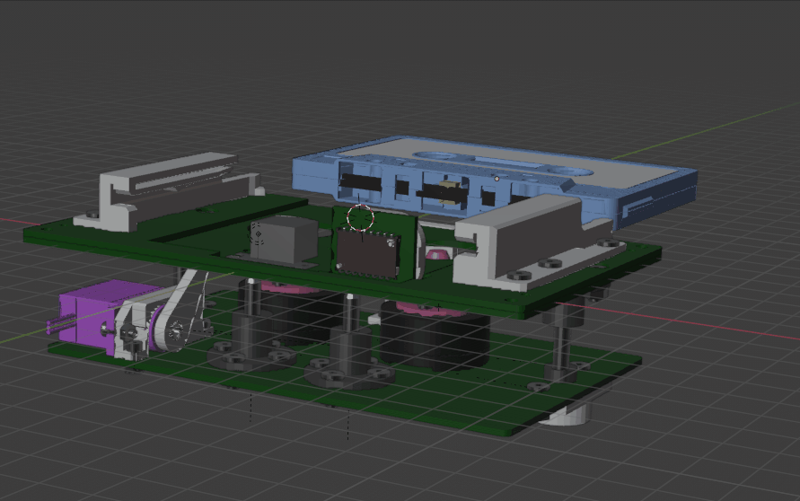
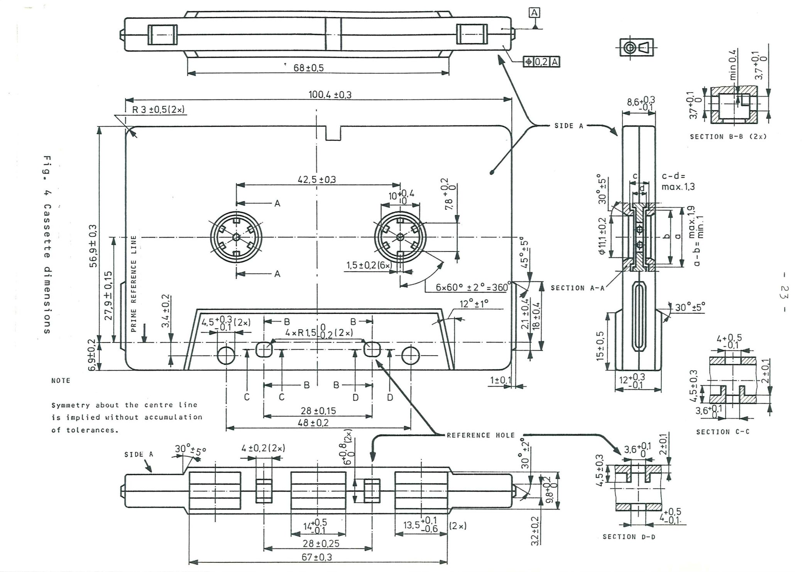
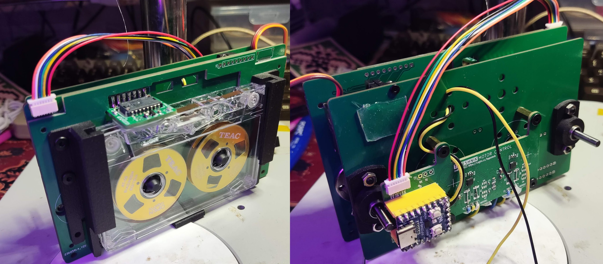
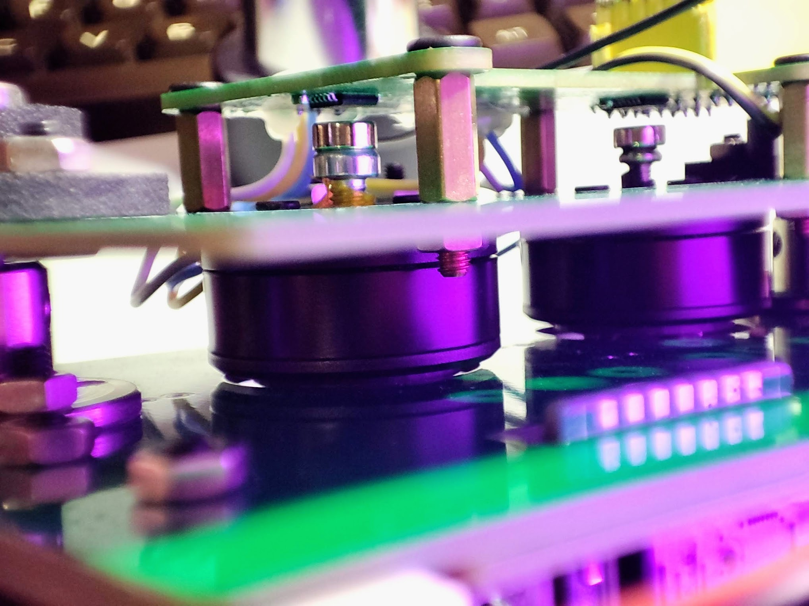
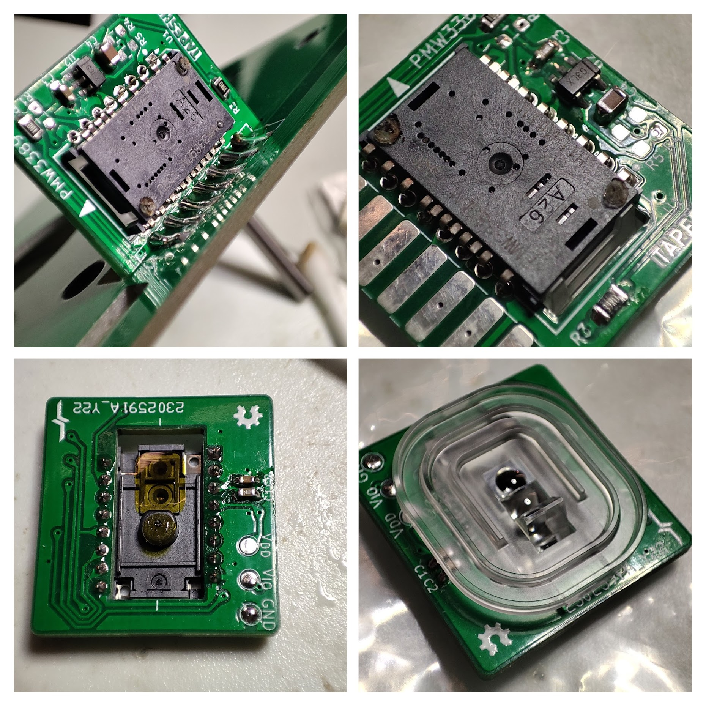

# Tapeshnik Futuristic Notes

While the current mechanism works, its limitations are obvious and its reliability is questionnable. Shall something break, it will be getting harder to get a replacement.

As a tangent project, I have an idea to design a simple, relatively easy to repeat tape mechanism that could be built from scratch using available parts. Obviously the heads will still have to be sourced, but cassette heads are relatively abundant.

As an inspiration I have TEAC D/CAS system. It uses tapes that look almost identical to Compact Cassettes. It's a two-motor direct drive system without a capstan. 

In D/CAS like TEAC MT-2ST, tape speed is closed-loop controlled by a closed loop servo, formed by the takeup reel motor and tape speed sensor. The tape speed sensor is not unlike a pinch roller, except that it does not pinch, instead rotates by friction with tape and provides speed reading.

Stable tape speed is useful, but depending on method of writing it may be not required. For example, a good PLL on FM or differential manchester can recover +-5% speed variation without issue, probably more with extra tweaks. But even better, if we sacrifice one of the tracks to reference clock signal, tape speed becomes almost a non-issue.

It's still worth researching sensing tape speed of course. Could a laser mouse sensor be used for that? In my past experiments, mice sensors experience frequent lapses which makes them useless for absolute position servo control. For speed sensing dropouts are also undesirable, but they may be a less significant problem.

The main frame of the mechanism can be built from several layers of PCB material stacked, connected via screws or standoffs. To insert a cassette it's necessary that some parts of the assembly move. We can either move the heads into the cassette, or motor spindles could be raised into the hubs when the cassette is inserted. I think the motors, or even just spindles, would be easier to move and the tolerances are much less tight for the spindles.

### RW heads

Ideally a 4-track head is needed. Erase head is not strictly necessary and a regular fixed autoreverse head would work.

### Motors

It's not 100% clear which kinds of motors are used in D/CAS, but at least some early versions used DC motors with speed controlled by current. That's cool but hard to match using off the shelf DC motors available today.

These days I think it's more practiccal to use BLDC motors. They are well researched and existing solutions for various kinds of BLDC control are available. Apparently we're looking for low-KV gimbal type motor, which should also be slotless to minimise cogging. An example of such a motor is JDPOWER MY-2813C, 75 yuan @ taobao. It seems to be slotless, although not with 100% certainty.

It is also worth checking out if DVD motors can be used as well. They are not designed with small speed in mind, but they have ring magnets so they may cog less.

Motor controller board is going to use [SimpleFOC](https://simplefoc.com/).

Motor drivers: [STSPIN233](futuristic/stspin233-1.pdf)

### Sensor

List of "known good" mouse sensors from the point of view of gamers. 
https://thegamingsetup.com/gaming-mouse/buying-guides/flawless-mouse-sensor-list

A quick test shows that my random mouse at least sees the tape moving in the cassette. Worth investigating.

The sensor to be tested is [PMW3389DM-T3QU](futuristic/pixart_pmw3389dm-t3qu_-_productbrief_1374785_20.pdf)

### Standards

[STANDARD ECMA-34](futuristic/ECMA-34_3rd_edition_september_1976.pdf) has good technical drawings of D/CAS cassette. With the exception of the asymmetrical dent and lack of pressure pad, it's identical to Compact Cassette. I used this drawing as my reference:

### Update 08-DEC-2025

Here's a couple of pictures of the current state of the project:

Motors spinning

Both motors are controlled by RP2040-Zero for now, using SimpleFOC Arduino library using Philearlehower core. Only the basic control is implemented, something like PLAY/FF/REW/STOP. No tape travel speed estimation is done and the optical sensor is not yet used. 

My motors didn't have the encoder mounted and it turns out you can't just stick a magnet onto a hollow shaft and hope that it stays put. The shaft also has a rather weird 3.8mm inner diameter. I was able to find a couple of screws that stick in there reasonably well, but a more repeatable solution is needed.

The optical chip is obviously Vorlon technology. This module was finicky to assemble.  Also I didn't make the solder pads from the other side of the platen so the space for soldering the PCB at the right angle was very tight. I think it ended up being offset from the centre of the tape a bit too much. We'll see if this sensor can see the tape at all.

