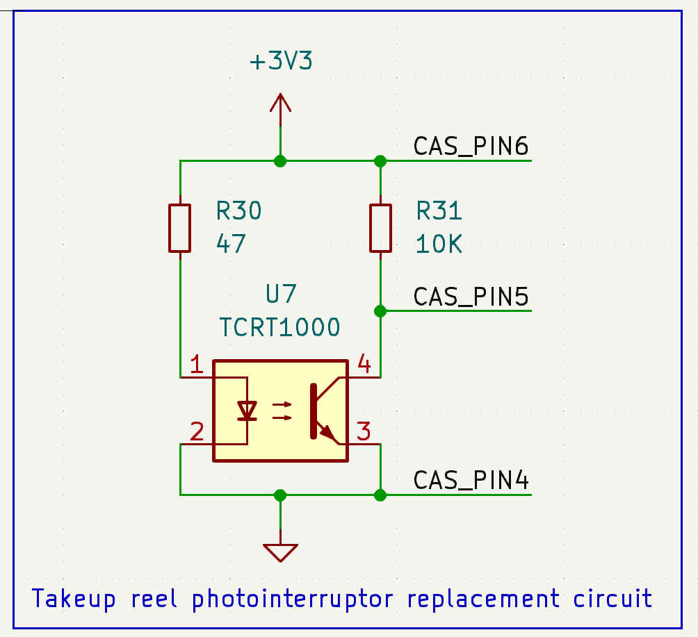
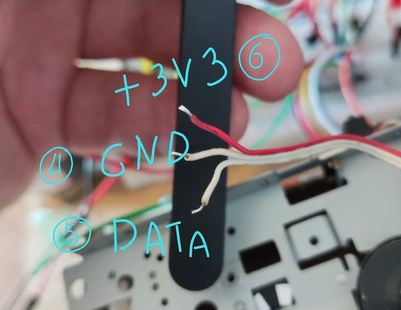
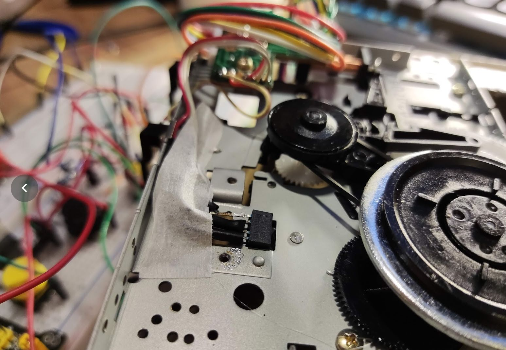
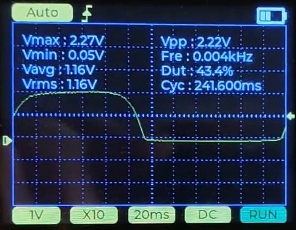
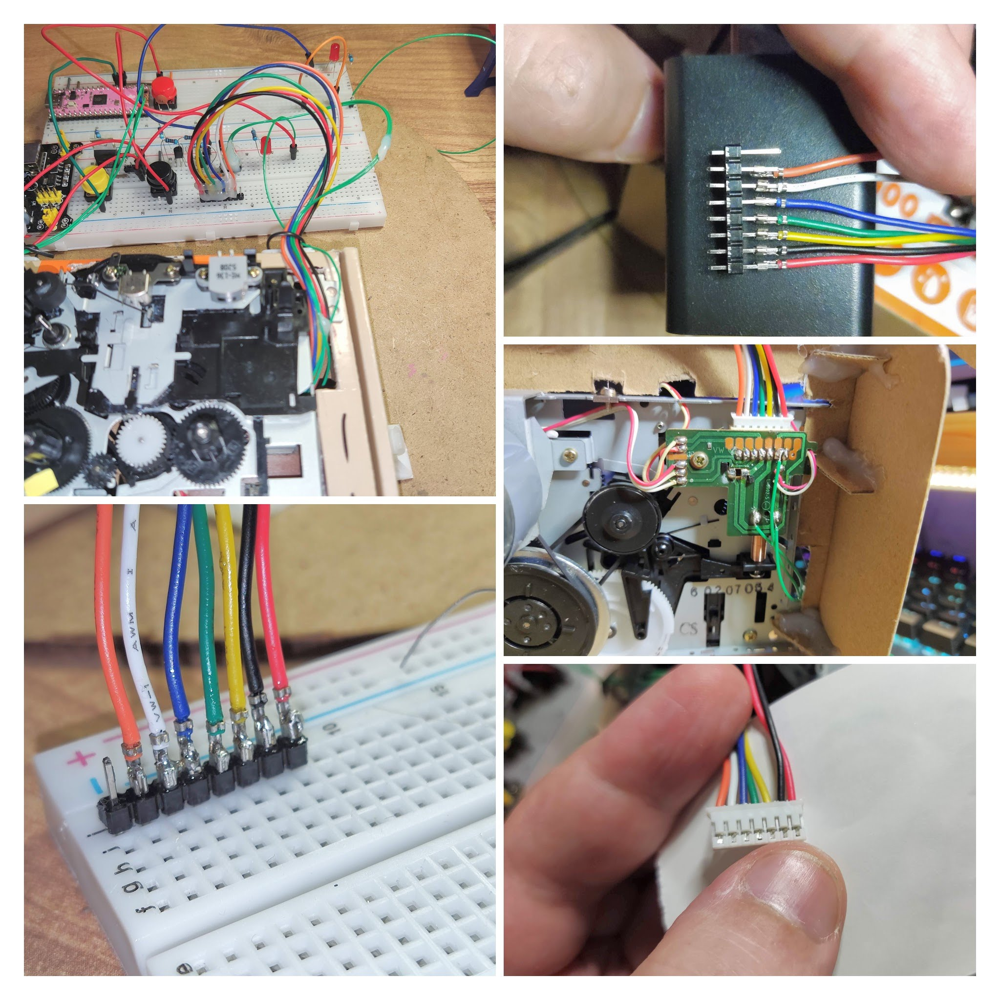
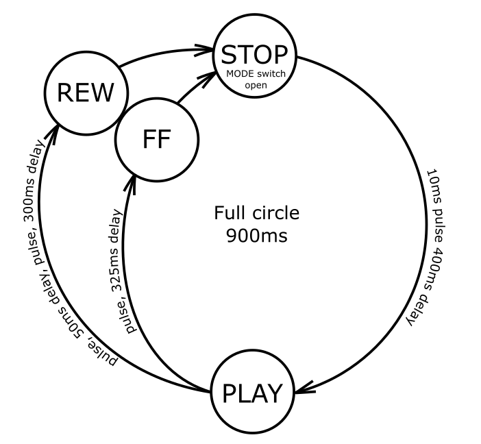
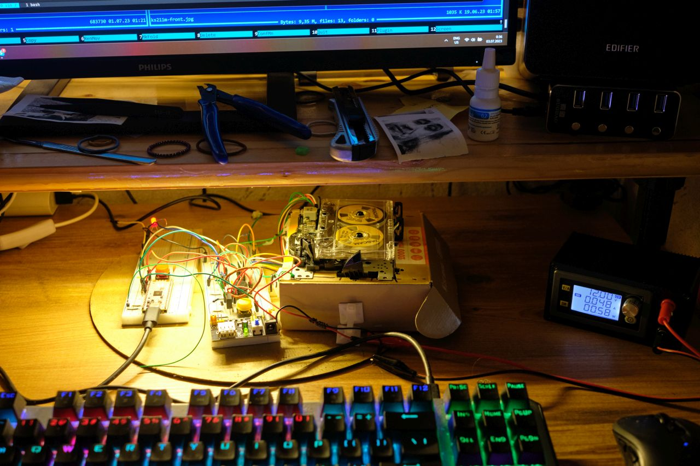
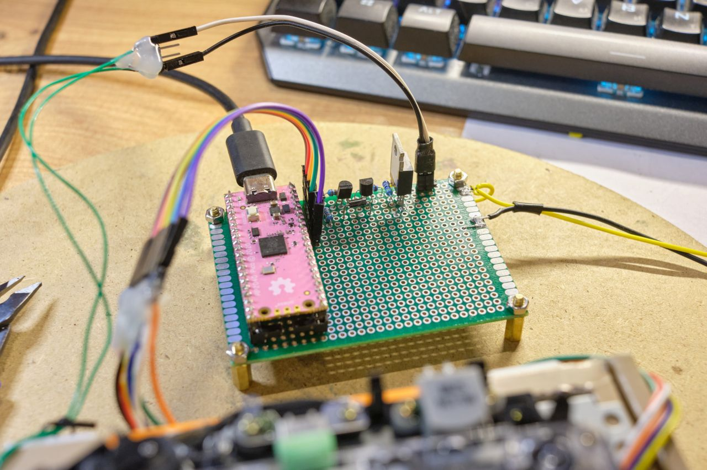
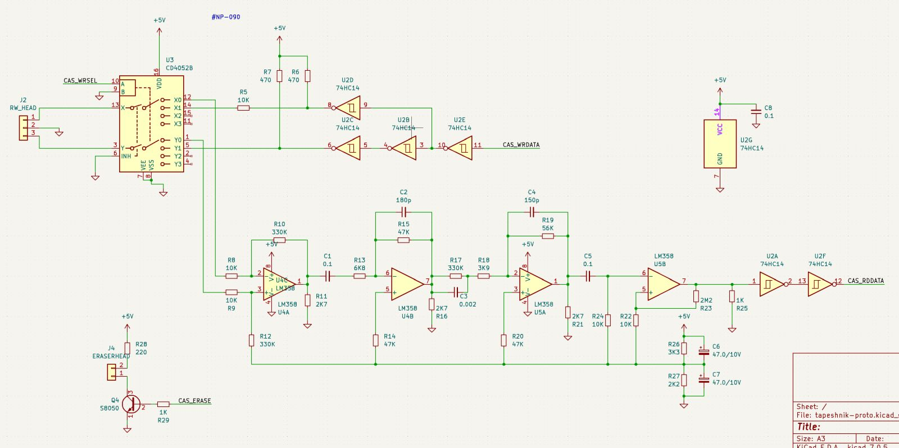
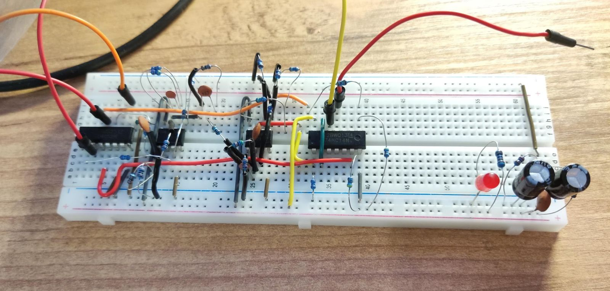

# Tapeshnik

## ME-136 KS211M

### Mechanism Overview

ME-136 KS211M is a moniker for a logic controlled compact cassette mechanism sold in China.

ME-136 is the erase head. KS211M is Write/Playback head. The actual mechanism thus seems to have no name or part number. It is sold as new, but the belts seem to be weak from the start.

The only thing that's known is this little circuit diagram:

*THIS CIRCUIT IS HIGHLY SUSPECT!*

 * Pin 0: not shown, not connected
 * Pin 1: write enable
 * Pin 2: mode wheel switch, open when the wheel reaches STOP position
 * Pin 3: control solenoid 12V (high-side switch)
 * Pin 4: GND
 * Pin 5: Photo interruptor output
 * Pin 6: Photo interruptor +5V
 * Pin 7: cassette detect

In reality the sensor board on my mechanism didn't have any resistors. I'm afraid I found it out too late. Maybe I damaged the photo sensor, or maybe it's some different thing entirely, but I'm replacing the sensor and changing the circuit to use a more sensible open-emitter connection. I removed the original sensor board and replaced it with this circuit using TCRT1000 reflective photo interruptor that I was able to find.

Here are the wires that go to the original sensor board, labeled.

Photointerruptor with resistors hidden in the heat shrink tubes, tightly squeezed into the position of the old sensor board.

The reflective sector wheel on the takeup reel. Monitoring it should help detecting when the tape is not moving and autostop must be engaged.

The signal on the phototransistor collector (connector pin 5 after modiifcation).

 

I don't know the exact name of this kind of connector, but it has 2.0mm pitch and the cables can be bought, the search term is PH2.0MM间距端子线. For easy prototyping I removed the housing from the other end of the cable and soldered the contacts to a 2.54mm pin header.

The motor pins are not on the main connector. It is a 12V DC motor. Connections on the motor are clearly marked "+" and "-". If my PSU is to be trusted, the motor alone consumes 0.045A at 12V in playback mode.

### Control

The mechanism modes are selected by pulsing the solenoid. The feeler arm follows the grooves on the command wheel and sets relevant parts of the mechanism in motion.

The full turn of the command wheel takes approximately 900ms.

The wheel has 3 characteristic positions: 12 hours: STOP, 6 hours: PLAY, 10 hours: FF/REW.

The solenoid needs a pulse of about 10ms to begin state transition. Holding the pulse for longer is not necessary. It is possible that holding solenoid voltage works better than short pulses, I don't know which is the recommended mode of operation. Short pulses seem safer for the semiconductors.

#### Command wheel state transitions

 * From STOP position, the first pulse will always put mechanism in PLAY position. 
 * From PLAY position, a single short pulse transitions to FF position.
 * From PLAY position, a short pulse + 50ms delay + a short pulse transitions to REW position.
 * From FF/REW any pulse transitions to STOP position.

#### Tachometer and autostop
This mechanism has no dedicated autostop sensor. The only way to implement autostop is by sensing rotation of the takeup reel. Same signal can also be used to implement a tape counter. A C60 cassette has approximately 13270 counts. The simple sensor has no way of telling rotation direction, so the counter tends to run away pretty quickly when there is a lot of back and forth with the tape. It should be possible to improve tracking by adding quadrature sensor like AEDR-8300.

Autostop is implemented with a help of a recurring timer. Every once in a while, a timer callback increments the counter. A tacho interrupt callback resets the counter. If the timer counter reaches certain value, e.g. 2, it means that it was not reset because the takeup reel is not spinning anymore and it's time to stop. This number would be different depending on fast / slow tape speed, but it also depends on where in the reel we are. A full spool near the end of tape spins slower.

Another safety mechanism is broken tape detection. An unusually quickly rotating takeup reel indicates that the tape is not held back by the capstan/pinch roller and is likely torn. The mechanism will also stop if unusually fast rotation is detected.

After a short while (1500ms) after full stop, the main motor is turned off.

#### Control conclusion

This could be built on a breadboard in a more compact way than I did it initially, but I transferred the working design to a protoyping board. I'm not the best when it comes to working on these things, but eventually I got the things right and the control circuit is now pretty solid. This opens up the way to work on the magnetic circuits.

### Magnetics

I'm expecting to get some results with this circuit that I copied from Commodore 1531 assembly version NP-090:

My only change here is the addition of CD4052 multiplexor to switch between output and input circuits. I don't yet know if it's going to work.

Assembled amplifiers on the breadboard.

