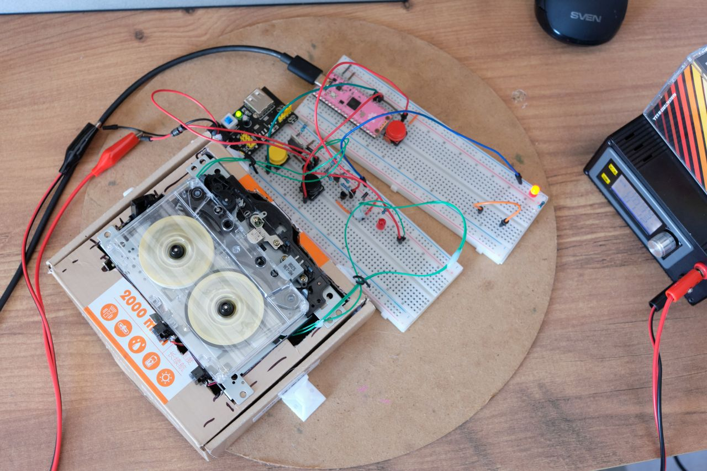
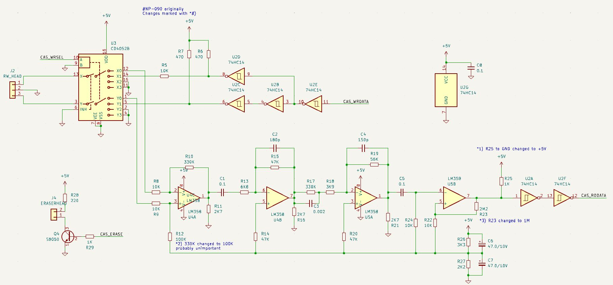
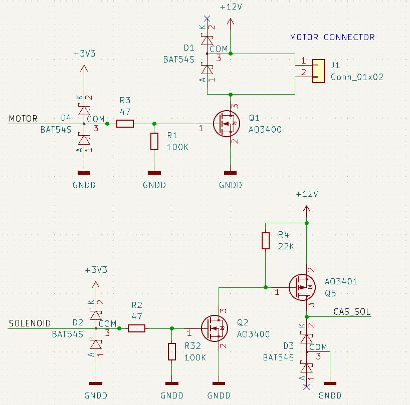

# Tapeshnik

## ME-136 KS211M

### Mechanism Overview

ME-136 KS211M is a moniker for a logic controlled compact cassette mechanism sold in China.

ME-136 is the erase head. KS211M is Write/Playback head. The actual mechanism thus seems to have no name or part number. It is sold as new, but the belts seem to be weak from the start.

The only thing that's known is this little circuit diagram:

*THIS CIRCUIT IS HIGHLY SUSPECT!*

 * Pin 0: not shown, not connected
 * Pin 1: write enable
 * Pin 2: mode wheel switch, open when the wheel reaches STOP position
 * Pin 3: control solenoid 12V (high-side switch)
 * Pin 4: GND
 * Pin 5: Photo interruptor output
 * Pin 6: Photo interruptor +5V
 * Pin 7: cassette detect

In reality the sensor board on my mechanism didn't have any resistors. I'm afraid I found it out too late. Maybe I damaged the photo sensor, or maybe it's some different thing entirely, but I'm replacing the sensor and changing the circuit to use a more sensible open-emitter connection. I removed the original sensor board and replaced it with this circuit using TCRT1000 reflective photo interruptor that I was able to find.

Here are the wires that go to the original sensor board, labeled.

Photointerruptor with resistors hidden in the heat shrink tubes, tightly squeezed into the position of the old sensor board and reliably fixed in place.

The reflective sector wheel on the takeup reel. Monitoring it should help detecting when the tape is not moving and autostop must be engaged.

The signal on the phototransistor collector (connector pin 5 after modiifcation).

 

I don't know the exact name of this kind of connector, but it has 2.0mm pitch and the cables can be bought, the search term is PH2.0MM间距端子线. For easy prototyping I removed the housing from the other end of the cable and soldered the contacts to a 2.54mm pin header.

The motor pins are not on the main connector. It is a 12V DC motor. Connections on the motor are clearly marked "+" and "-". If my PSU is to be trusted, the motor alone consumes 0.045A at 12V in playback mode.

### Control

The mechanism modes are selected by pulsing the solenoid. The feeler arm follows the grooves on the command wheel and sets relevant parts of the mechanism in motion.

The full turn of the command wheel takes approximately 900ms.

The wheel has 3 characteristic positions: 12 hours: STOP, 6 hours: PLAY, 10 hours: FF/REW.

The solenoid needs a pulse of about 10ms to begin state transition. Holding the pulse for longer is not necessary. It is possible that holding solenoid voltage works better than short pulses, I don't know which is the recommended mode of operation. Short pulses seem safer for the semiconductors.

#### Command wheel state transitions

 * From STOP position, the first pulse will always put mechanism in PLAY position. 
 * From PLAY position, a single short pulse transitions to FF position.
 * From PLAY position, a short pulse + 50ms delay + a short pulse transitions to REW position.
 * From FF/REW any pulse transitions to STOP position.

#### Tachometer and autostop
This mechanism has no dedicated autostop sensor. The only way to implement autostop is by sensing rotation of the takeup reel. Same signal can also be used to implement a tape counter. A C60 cassette has approximately 13270 counts. The simple sensor has no way of telling rotation direction, so the counter tends to run away pretty quickly when there is a lot of back and forth with the tape. It should be possible to improve tracking by adding quadrature sensor like AEDR-8300.

Autostop is implemented with a help of a recurring timer. Every once in a while, a timer callback increments the counter. A tacho interrupt callback resets the counter. If the timer counter reaches certain value, e.g. 2, it means that it was not reset because the takeup reel is not spinning anymore and it's time to stop. This number would be different depending on fast / slow tape speed, but it also depends on where in the reel we are. A full spool near the end of tape spins slower.

Another safety mechanism is broken tape detection. An unusually quickly rotating takeup reel indicates that the tape is not held back by the capstan/pinch roller and is likely torn. The mechanism will also stop if unusually fast rotation is detected.

After a short while (1500ms) after full stop, the main motor is turned off.

#### Control conclusion

This could be built on a breadboard in a more compact way than I did it initially, but I transferred the working design to a protoyping board. I'm not the best when it comes to working on these things, but eventually I got the things right and the control circuit is now pretty solid. This opens up the way to work on the magnetic circuits.

Video demo of motor control: https://www.youtube.com/watch?v=q-qPT_CDH74

### Magnetics

I'm expecting to get some results with this circuit that I copied from Commodore 1531 assembly version NP-090. Hopefully CD4052 will allow head commutation on the fly, if it does not, I'll have to find a better way.

First writing experiment video: https://www.youtube.com/watch?v=b4VsjFtVbdQ

(Updated 23.07.23)

The circuit didn't work fully as expected, I had to troubleshoot it and make some changes. Video of troubleshooting process: https://www.youtube.com/watch?v=exBDKgd-HhU

Problems that I encountered:
  * low noise immunity: changed some routing on the breadboard, removed cd4052 for the time being, increased hysteresis
  * asymmetric waveform, 45-35% duty cycle instead of expected 50%. Changed R25 to pull up to +5 instead of GND

Assembled amplifiers on the breadboard (before the debugging)

## Logic

Current goal: MFM. Example transport-level layout: 
  * leader sequence for PLL tune-up and to compensate for r/w switching and mechanical variance ~32 bytes
  * sync A1
  * 255 bytes data
      * 223 bytes payload
      * 32 bytes fec

Data payload layout:
  * track number [1]
  * sector number [3]
  * short copy of dirent: filename [12] + block number [4]
  * data [200]
  * crc-16 [2]
  * reserved [1]

Algorithm for writing sector number N+1:
  * locate sector N
  * read until the end
  * switch into write mode
  * write sector N+1

Or maybe should the sector marks be written once, leaving some small gaps for the rewrittable sections? In that case, for example

  * leader tone, A1, sector-number, A1, sector-number, A1, sector-number
  * long gap to fit the entire block of data, including the leader and its own sync sequence
  * next..

I've had some success in writing and reading data to tape, which is partly documented in the videos. Shortly after implementing soft head switching circuit using cd4052, I managed to cook my main work Pi Pico board. I don't know what exactly happened, probably a ground disconnect or something like that sent wrong voltage up GPIO pins. Curiously, the controller still works, but several GPIO pins don't function and it's abnormally warm to touch. While the board and new parts are in the post, it's time for a new hardware revision. I decided to take a break from tinkering and design a proper PCB. The design seems to be functional and I hope having a solid board with fewer dangling wires would make it easier to develop further. 

## Hardware revision 1

### Dealing with various voltages

Pi Pico is 3.3V, not 5V tolerant and we're dealing with 12V motor and solenoid plus 5V opamp circuits.

#### 12V

I redesigned +12V control circuits with a bit of a paranoid streak:

The expectation is that if 12V would somehow leak back up GPIO side, the beefier BAT54S would withstand a larger current, and the current would be limited by R3 and R2.

Initially I used a lab supply to power the motor and solenoid, and USB bus power for everything else. This is ok for some tests, but it has become a bit too clunky. Also a catastrophic disconnect of a single wire could lead to my Pico getting cooked. So I decided to generate all voltages on board. 

To generate 12V, I want to use this DC-DC converter based on SX1308. 

The Chinese description says SX1308 DC-DC可调升压板2A, but it's unclear which part of it is taking 2A. It seems that it should be able to handle 12V/50mA needed by the motor. I'm a bit worried by solenoid, even though it's only used momentarily.

I only measured 4.5V on my USB bus power. This is not great for the analog section, so I decided to derive 5V with an LDO from the on-board generated 12V.

Digital and analog grounds are separated. On PCB they join together at one point near the LDO.

There's a tap after the second stage of amplification that should in theory allow analog sampling of the signal. I'm really unsure about characteristics of the signal at this point, so there's an N/C resistor separating that part from ADC input pin. This part is not really in the current goals, but I wanted to leave something open for further experimentation here. Unfortunately I forgot to add clamp diodes on these pins too. Something to keep in mind.

Waiting time...

And while we're waiting, it's time for the [FUTURISTIC](FUTURISTIC.md) TAPESHNIK-MECHA !

### Tapeshnik Proto 2

There was a couple of mistakes and some mishaps, but the new design seems to be good. I had to fix / bodge a couple of things.

#### Flipped p-MOSFET
The first one is a classic of course, forgot to flip p-MOSFET drawing in the high side switch circuit. This is what the fixed version looks like:

#### Power up inrush current
In this new version all power is provided by USB bus. Higher voltage neede by the motor and the solenoid is generated by a DC-DC converter. When the device is just plugged in, the inrush current may make the host think that something is not right with this device, cancel enumeration and shut down the port for protection. SX1308 chip has enable pin, but unfortunately on the modules that are sold everywhere, mine included, EN pin is dead shorted with Vin, so it can't be easily disabled. I didn't think this through at first, so I had to add this feature on a bodge. The circuit is like this:

The additional benefit is that I can completely shut down the boost converter and go low power.

#### Weak DC-DC
SX1308 modules are described as "2A", but the reality is that they're not very efficient when boosting up to 12V. Here's a link to [Matt's Electronics](https://www.matts-electronics.com/wp-content/uploads/2018/06/SX1308.pdf) with a characterization of these modules and we can see that their efficiency takes a sharp nosedive at around 9-10V output when boosting up from 4.5-5V like I have here. This results in solenoid being very weak, I almost had to give it a helping hand sometimes. Luckily, both the motor and the solenoid work really well at 9.5V and at this voltage SX1308 is happy to push enough amperes. So my +12V is now +9.5V.

#### Continuing from where I left
There were some other mishaps not worthy of mention, mostly caused by my poor soldering and parts mishandling. 

After everything was sorted out, I managed to read the data from my cassette. 

[Tapeshnik is alive again (youtube short)](https://youtube.com/shorts/GOCvX2H30LI)

### Encoding, speed and errors

The new board with shielded cable to the heads work much better than my previous build. I've switched the encoding to MFM, although I'm not sure if it really performs better than FM. It seems that I can't reliably go beyond 700cps net. Which is a very respectable speed, but I feel that it could be better yet. Anything faster than that is prone to unrecoverable errors.

I performed successful sector data replacement tests. In the test I seek by reading sectors prior to the one that's to be replaced, switch into write mode and write new data. It works well, although I suspect that there is a misalignment caused by slight time deviations and eventually rewriting a sector might shift it, or other sectors. So I need a new sectoring scheme.

#### New sectoring scheme

The idea is to have sectors pre-recorded initially. Pre-recorded sector info will not be modified during normal operation. So the tape format is going to be like so:

  | SECTOR LEADER | SECTOR SYNC | SECTOR NUM | front gap | PAYLOAD LEADER | PAYLOAD SYNC | PAYLOAD | rear gap |

This is very much like floppy disk format. Another level of matrioshka adds overhead, but it allows for a rigid sector structure that can be maintained in random-access usage.

It's possible to pack several payloads in one "physical" sector. Payload size is defined by libcorrect, it's 255 bytes, 223 of which are user data. One physical sector could contain one or more payloads, for example 4 seems like a reasonable compromise between sector length/time to seek and content size. Perhaps payloads within a sector could be block-interleaved for better resilience to long burst errors.

SECTOR SYNC and PAYLOAD SYNC should be different, for example:

SECTOR SYNC: 1100110011000111  CCC7
PAYLOAD SYNC:1100110011100011  CCE3

SECTOR NUM can be tripled for majority vote error correction.

To be continued...
