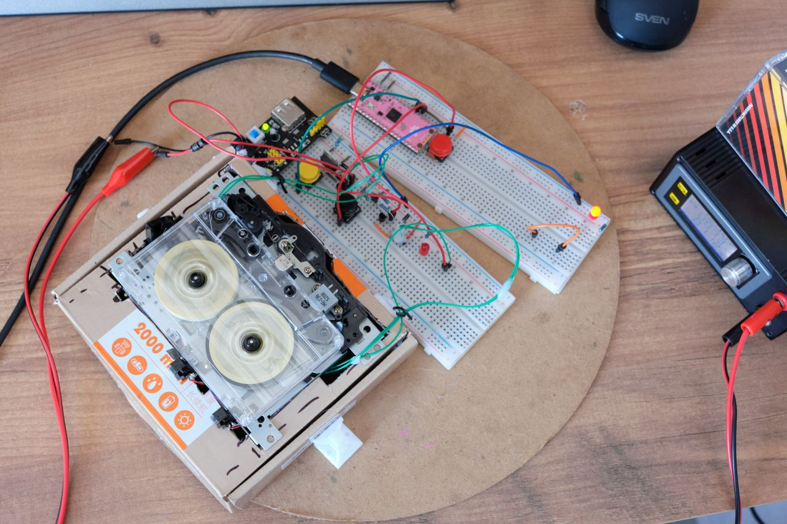

# TAPESHNIK 

Tapeshnik is a series of experiments with Compact Cassette tapes using a mix of traditional and modern technologies with focus on data storage.

## Iteration 1

Iteration 1 uses a purchased single-motor mechanism with a command wheel logic control. 
Read/Write circuitry is heavily based on Commodore datasette. Pi Pico is the microcontroller that does logic level data encoding/decoding and deck control functions.

[Iteration 1 Notes](NOTES.md)

It was a moderate success, but not a breakthrough in data storage.

## Iteration 2

I always liked the idea of drives without rubber belts. Making a precision mechanism with a capstan can be a very demanding task. 
Some old data drives used to have no capstan, for example:

 * [Digital TU56 Dectape](https://gunkies.org/wiki/TU60_DECasetteTape_Transport)
 * [Digital TU60 DECassette](https://gunkies.org/wiki/TU60_DECasetteTape_Transport)
   * [Detailed description, principle of operation, data format of TU60](https://bitsavers.org/pdf/dec/decCassette/DEC-00-HTU60-C-D_TU60maint_Oct73.pdf)
 * Coleco Adam Digital Data Pack
 * [D/CAS drives](https://en.wikipedia.org/wiki/D/CAS)
 
Some of them use pre-recorded timing servo track, others appear to use robust encodings that let them recover data despite high tape speed variations.

This gave me ideas for a new experiment with building a fully custom deck without capstan.

This is currently a work in progress.

[Iteration 2 "FUTURISTIC" Notes](FUTURISTIC.md)

[youtube playlist](https://www.youtube.com/playlist?list=PLuOXWyWDhULNxkAvCRtwkEgnuxFfULnF9)
